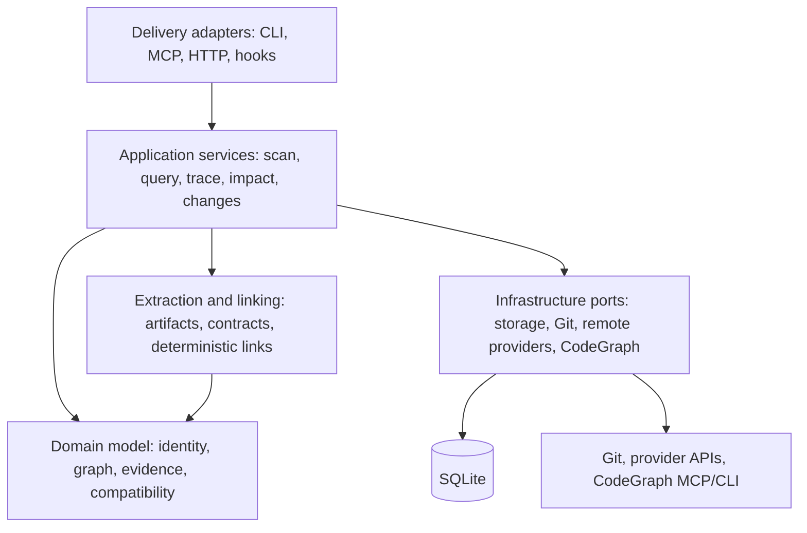

# Code System Graph Architecture

Code System Graph builds a federated graph of repository boundaries, contracts, deployments, ownership,
evidence, and immutable snapshots. It complements repository-local symbol and call graphs instead
of duplicating them.

## Design principles

- Dependencies point inward toward domain types and application-owned ports.
- Extraction is conservative: ambiguous or dynamic observations remain explicit and unlinked.
- Durable data is source-free and secret-safe.
- Published snapshots are immutable and become visible atomically.
- Query results expose freshness, coverage, evidence, ambiguity, and truncation.
- External providers are optional, bounded adapters rather than sources of graph truth.

## Layers



### Delivery

Versioned application contracts serve the CLI, the read-only MCP stdio server, the optional
authenticated HTTP server, exports, diagnostics, and host hooks. Administrative MCP operations are
available only when the administrative profile is enabled; normal discovery remains read-only.
Delivery adapters validate and bound inputs before invoking application services.

### Application services

Application services coordinate workspace registration, scanning, search, trace, community
analysis, compatibility, impact, local changes, and pull-request inspection. They own transaction
boundaries and provider policies while remaining independent of SQLite, transport, and command-line
details.

Search combines quoted FTS5 candidates with exact and normalized identity, type, scope,
centrality, community, evidence quality, and freshness signals. Traversal uses bounded directed
BFS, confidence-weighted Dijkstra, or loopless k-shortest paths. Confirmed paths never silently
include candidate edges.

Impact analysis propagates upstream or downstream through bounded graph neighborhoods and reports
confirmed, possible, and coverage-unknown paths separately. Compatibility analyzers compare
structured before-and-after contracts without mutating graph state. Numeric risk is omitted when
coverage is insufficient.

### Domain model

The domain layer defines stable identities, typed nodes and edges, evidence, snapshots, freshness,
compatibility findings, communities, changes, and impact views. Cross-language relationships are
formed through shared contracts, not language-name heuristics:

```text
test_case --validates--> contract --implemented_by--> symbol_ref
```

Graph validation rejects duplicate identities, dangling references, invalid confidence values,
malformed locations, unsafe metadata, and unbounded fields before publication.

### Extraction and deterministic linking

Tree-sitter parsers and narrow framework recognizers extract literal or conservatively resolvable
facts. Source-owned output batches are keyed by repository, checkout, lossless path, and extractor.
Their payloads contain structured observations and evidence locators, never source bodies.
Unchanged compatible batches can be reused while affected link neighborhoods are recomputed.

Extractors cover package and HTTP contracts, events, GraphQL, protobuf and gRPC, SQL and ORM data,
Docker Compose, Kubernetes, Helm, Terraform and OpenTofu, Markdown and ADR references, CODEOWNERS,
service catalogs, and configuration metadata. Configuration extraction records key names, scopes,
and sensitivity classifications without values. Exact coverage and limits are documented in
`EXTRACTOR_COVERAGE.md`.

Package coordinates, event channels, GraphQL fields, RPC methods, data objects, deployments,
services, documents, owners, and configuration keys are normalized before linking. Duplicate
providers, dynamic values, unresolved selectors, and unknown generated roles remain unlinked.

Manifest `manualLinks` are applied after automatic linking and before publication. Each endpoint
must resolve exactly to one node ID or stable key. Additions replace the matching automatic edge
with confirmed manual provenance; suppressions remove only the exact automatic relationship.
Snapshot-scoped records preserve the declaration, reason, resolution, and history.

### Infrastructure adapters

SQLite stores the registry, immutable snapshots, source-free extraction batches, communities,
manual links, provider capabilities, and bounded query summaries. A single blocking writer works
with WAL readers. See `DATA_MODEL.md` and ADR 0003 for storage details.

The local Git adapter emits repository state, native paths, changed-file layers, and line
positions without retaining diff bodies. GitHub and Bitbucket Cloud inspection is opt-in and uses
HTTPS allowlists, same-origin pagination, deadlines, and byte, item, and page limits. Patches and
raw responses are discarded before normalized metadata enters the ETag/TTL cache.

The CodeGraph port uses typed, bounded requests over public MCP capabilities or versioned CLI JSON.
Unknown versions, unavailable tools, stale indexes, and transport failures are returned as
degradation data. Exact path, name, and line agreement can corroborate an existing source-derived
anchor, but provider output does not create unsupported federated relationships. Source and context
returned by the provider remain ephemeral.

## Scan and publication flow

1. Validate the workspace manifest and canonicalize repositories beneath allowed roots.
2. Fingerprint relevant artifacts and plan added, modified, deleted, and reusable inputs.
3. Extract structured facts and evidence into source-owned batches.
4. Normalize identities and perform deterministic bilateral linking.
5. Apply exact manual additions and suppressions.
6. Validate the complete candidate graph and persist it in one transaction.
7. Publish the snapshot only after the transaction commits.

If scanning fails, the last valid snapshot remains queryable.

## Query and change flow

1. Resolve query anchors against the selected immutable snapshot.
2. Validate freshness and graph consistency.
3. Traverse only within declared direction, depth, result, and time bounds.
4. Optionally request bounded local context from CodeGraph.
5. Return results with evidence, coverage, freshness, ambiguity, warnings, and handoffs.

For local changes, semantic analysis intersects Git line positions with persisted evidence and then
invokes the same compatibility and impact services. Partial mappings remain unknown rather than
being inferred.

## Failure, concurrency, and lifecycle

Stale, partial, unavailable, and ambiguous inputs propagate into every answer. Lack of an observed
edge is distinct from confirmed absence; insufficient coverage yields `UNKNOWN`, never a
false-safe conclusion.

Tokio coordinates cancellation and bounded asynchronous work. Repository, extractor, and provider
concurrency use explicit semaphores. Shutdown cancels work, terminates child processes, drains
diagnostics, and leaves only fully published snapshots visible.

Operational and release details are documented in `INTERFACES.md`, `PERFORMANCE.md`,
`INSTALLATION.md`, `RELEASE.md`, and ADR 0009.
